1) Arrumar o GIT_TOKEN no arquivo 1_create_adk.sh

2) chmod +x 1_create_adk.sh
3) chmod +x 2_enrich_adk.sh
4) chmod +x 3_deploy_adk.sh

5) executar o 2_enrich_adk.sh
6) executar o 3_deploy_adk.sh

NOTES:
- A branch adk contém a estrutura processada com a primeira parte (1_create_adk.sh) processada 
- A branch adk-ee contém a estrutura enriquecida com o Starter Pack com a segunda parte (2_enrich_adk.sh) processada

### Verificar Permissões da conta de serviço:
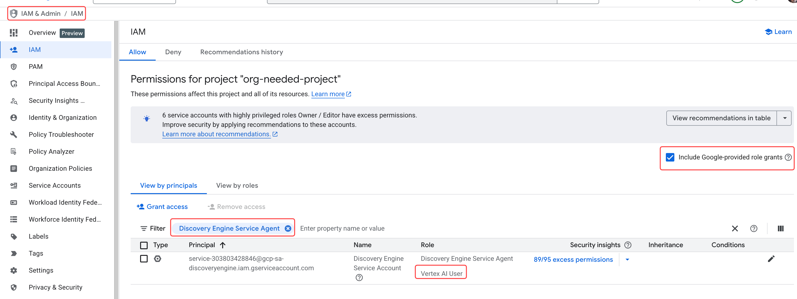

### Acessar o agente no Agent Engine
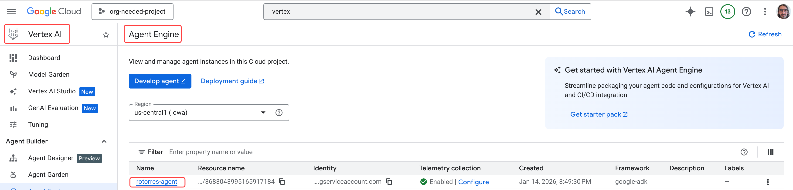

### Testar o Agente no playground
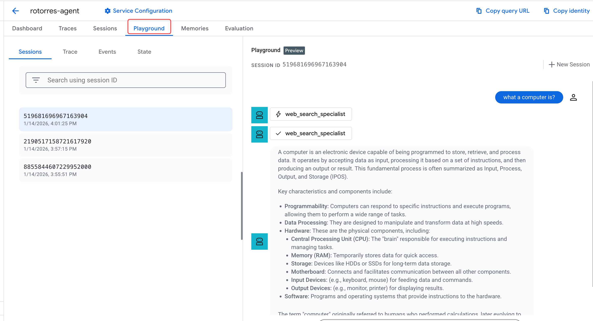

### Obter o código de reseource engine (reseource name do agente)
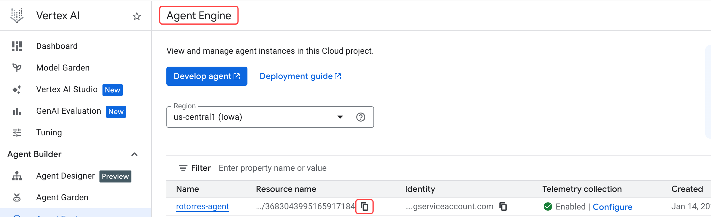

### Acessar a área de Agentes do Gemini Enterprise App
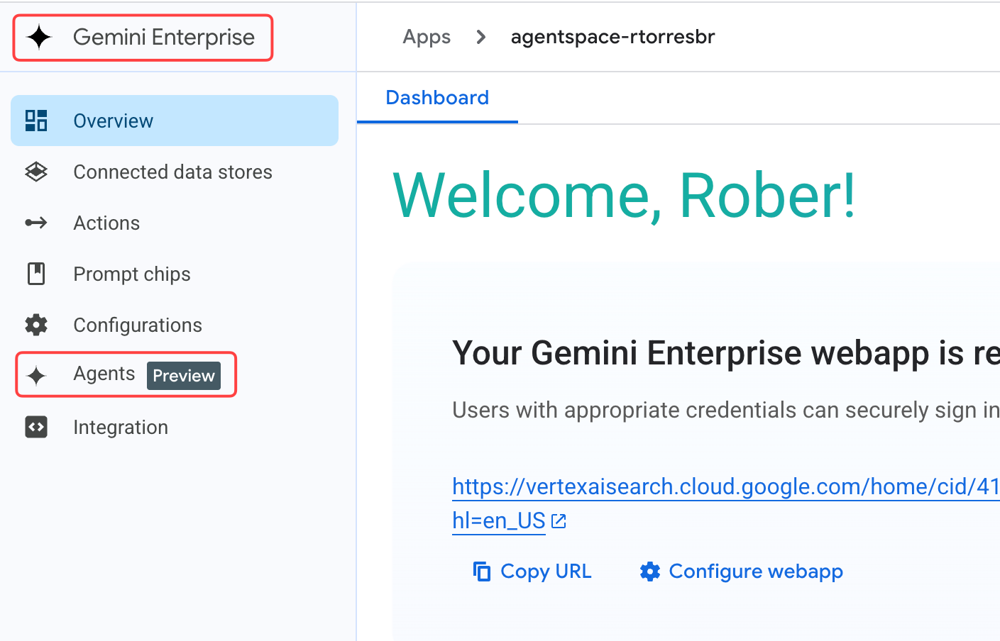

### Adicionar o agente de ADK customizado
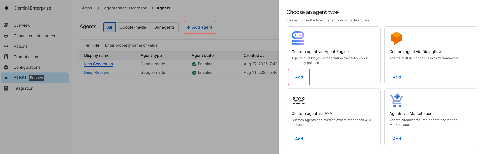

### Caso o agente não utilize serviços que dependam de autorização oAuth, seguir sem adicionar
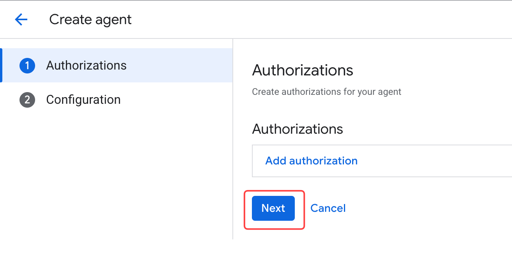

### Configurar o agente de ADK customizado
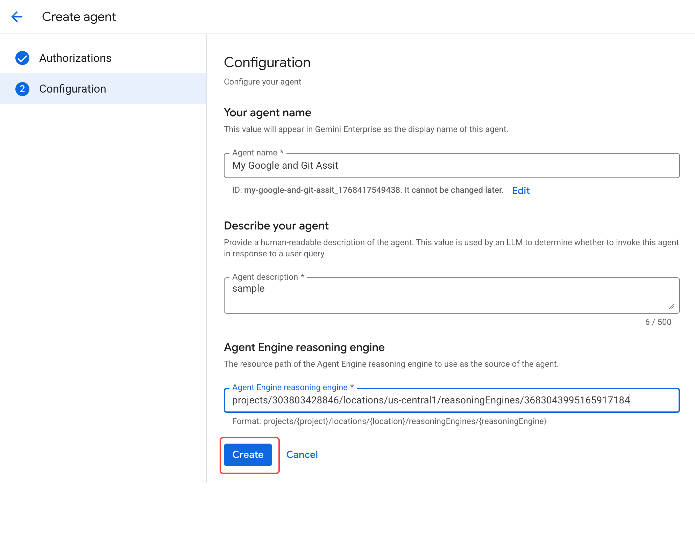

### Acessar o Agente vinculado
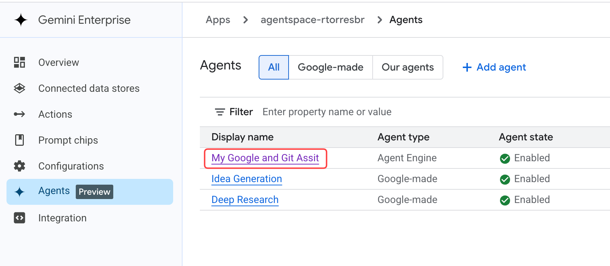

### Adicionar as permissões de acesso ao Agente
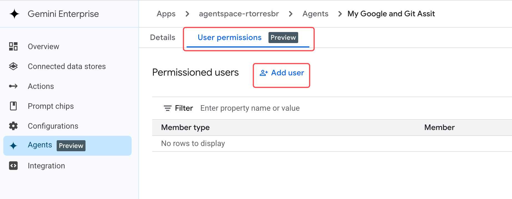

### Exemplo de permissão pra todos os usuários da organização
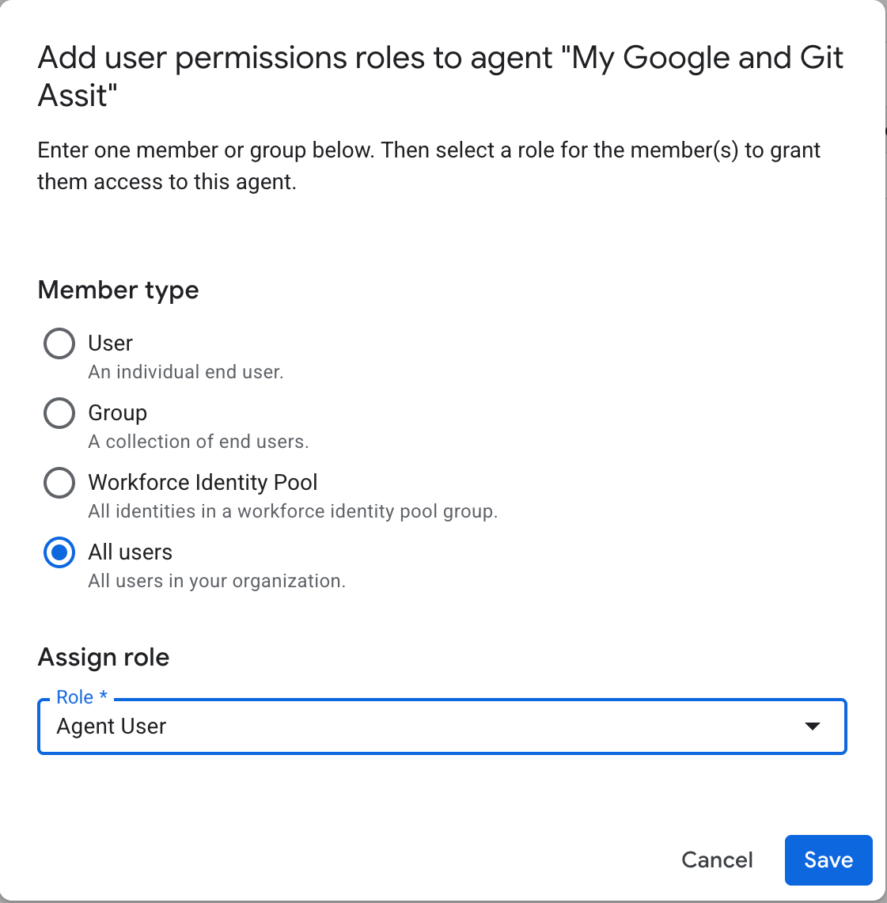

### Preview do Agente no Gemini Enterprise
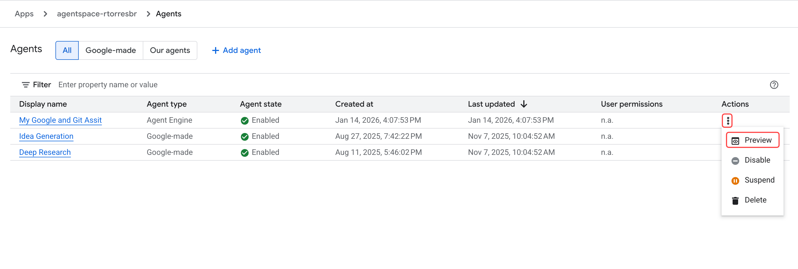

### Teste do Agente no Gemini Enterprise
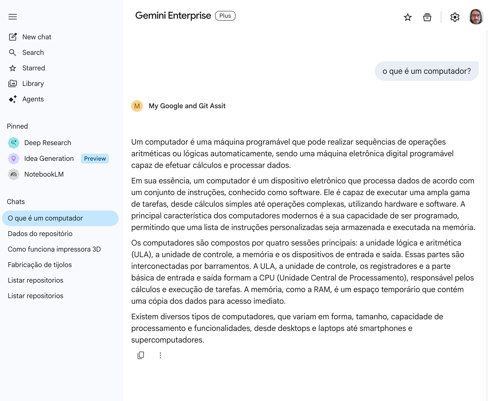

